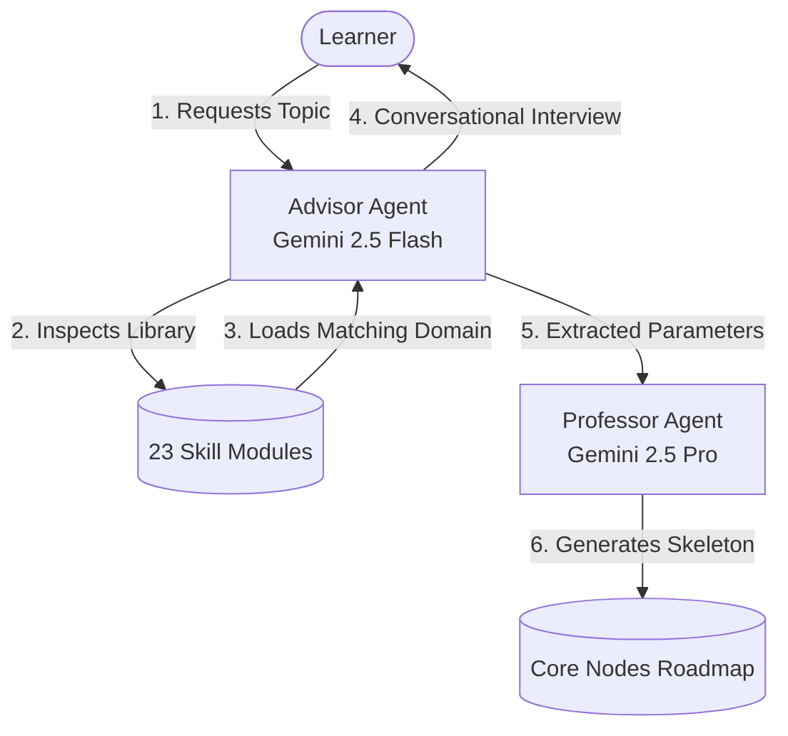
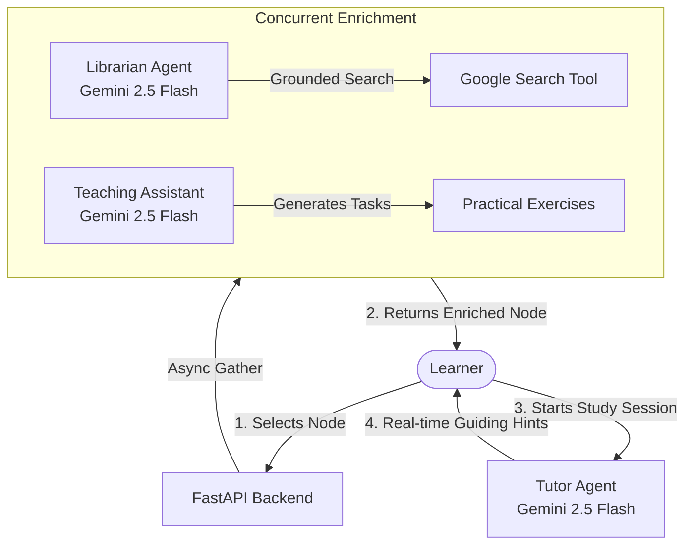
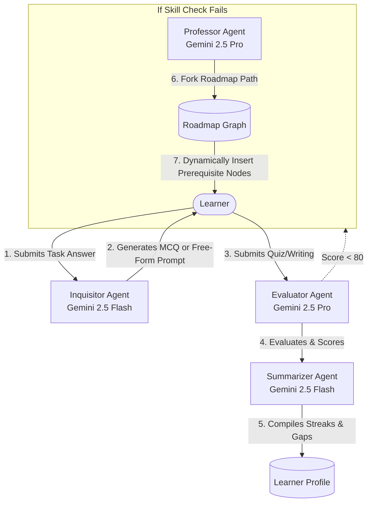

# 🚀 Know-Way

> **Slogan:** *"You Can't Know What You Don't Know"*

**Know-Way** is a state-of-the-art, adaptive learning roadmap application that visualizes skills as interactive graphs. By tracking your progress, offering real-time AI tutoring, and launching milestone quizzes, it keeps the focus on the knowledge you haven't discovered yet.

This project is built using **Gemini (2.5 Flash & 2.5 Pro)**, **Google Cloud Agent Builder (Agent Developer Kit - ADK)**, and the official **MongoDB Model Context Protocol (MCP) Server** to create a highly personalized, agent-guided learning experience.

---

## 🏁 Quick Setup & Run Guide (For Judges)

To run the full project locally, you will need to start both the **FastAPI Backend** and the **Next.js Frontend**.

### ⚙️ 1. Backend Setup (FastAPI)

1. Navigate to the backend directory and set up a virtual environment:
   ```bash
   cd backend
   python -m venv .venv
   # Activate virtualenv:
   # Windows:
   .venv\Scripts\activate
   # macOS/Linux:
   source .venv/bin/activate
   ```
2. Install Python dependencies:
   ```bash
   pip install -r requirements.txt
   ```
3. Copy the environment configuration:
   ```bash
   copy .env.example .env     # macOS/Linux: cp .env.example .env
   ```
4. Configure your `.env` variables with your `MONGODB_URI`.
5. **Google Cloud & Vertex AI (ADK) Authentication**:
   The Agent Developer Kit (ADK) connects to Gemini models via Vertex AI. You must configure local credentials:
   *   Install the [Google Cloud CLI](https://cloud.google.com/sdk/docs/install) on your machine.
   *   Log in and set up local Application Default Credentials (ADC) by running:
       ```bash
       gcloud auth application-default login
       ```
   *   Edit `.env` to specify your Google Cloud project details:
       ```env
       GOOGLE_CLOUD_PROJECT=your-google-cloud-project-id
       GOOGLE_CLOUD_LOCATION=us-central1
       ```
6. Start the FastAPI development server:
   ```bash
   uvicorn app.main:app --reload --port 8000
   ```
   * *Swagger API documentation will be available at http://127.0.0.1:8000/docs*
 
### 💻 2. Frontend Setup (Next.js)

1. Open a new terminal window, navigate to the frontend directory, and install npm packages:
   ```bash
   cd frontend
   npm install
   ```
2. Copy the environment configuration:
   ```bash
   copy .env.example .env.local     # macOS/Linux: cp .env.example .env.local
   ```
3. Configure Clerk Authentication keys in `.env.local` (or leave defaults for local unauthenticated dev environment).
4. Run the frontend development server:
   ```bash
   npm run dev
   ```
   * *The web interface will be available at http://localhost:3000*

---

## ✨ Key Features

### 🗺️ Adaptive Knowledge Graphs (Roadmaps)
Rather than a generic, static checklist, your learning journey is visualized as an interactive, net-like skill graph:
*   **Onboarding Interview & Assessment**: When you start a new topic, you go through a conversational interview. The system analyzes your experience level, available time, and scope of learning.
*   **Dynamic Generation**: Your roadmap is created specifically for you, combining your self-assessment with your evolving **Learner Profile**.
*   **Node Enrichment**: Each milestone (node) on the graph is automatically loaded with clear descriptions, hand-picked learning resources (videos, articles, courses), and practical tasks.
*   **Validation "Skill Checks"**: If you already have strong confidence in a topic, the graph automatically creates advanced "Skill Check" challenge nodes. This allows you to validate your mastery instead of repeating concepts you already know.
*   **Adaptive Path Remediation**: If you fail a Skill Check assessment, the application automatically triggers a path fork. The **Professor Agent** dynamically inserts 2-3 bridging prerequisite learning nodes under the parent topic, letting you master the underlying concepts before attempting the milestone challenge again.

### ⏱️ Guided Study Sessions & Node Progression
Progress along the roadmap is driven by active doing:
*   **How Progression Works**: Each learning node contains practical tasks. Completing these tasks unlocks adjacent concepts and guides you step-by-step to the next level of the roadmap.
*   **Interactive Study Timer**: Start a session to set a focused timer. During the session, you have real-time access to a dedicated **Tutor Agent** who helps guide you conceptually, answers questions, and suggests supplementary materials.
*   **Task Assessments & Personalized Evaluations**: At the end of a task, take a quick comprehension check. If it's a writing task, our grading agent evaluates your work and gives you a personalized score and detailed feedback pointing out what went well and what gaps to focus on.

### 📅 Daily Work Planner
Take control of your schedule with an integrated, drag-and-drop learning calendar:
*   **Personalized Scheduling**: Easily organize your weekly load by dragging and dropping learning tasks onto specific calendar days.
*   **Load Tracking**: The planner automatically tallies the estimated study hours lined up for the week, helping you maintain a consistent learning pace without getting overwhelmed.

### 👤 The Ever-Building Learner Profile
Your educational footprint grows with you:
*   **Continuous Feedback Loop**: We build a persistent profile of your knowledge, starting from your onboarding responses, updated by your task grades, and summarized by your overall progress.
*   **Agent Integration**: This profile is shared with all AI agents in the background. As you get better or struggle in certain areas, the agents automatically adjust the vocabulary tone, resources, and quiz difficulties to meet you where you are.

---

## 👥 Meet Your AI Agent Cohort

A dedicated team of specialized AI agents works in the background to curate your experience:

| Agent | Engine | Role | Where You'll Meet Them |
| :--- | :--- | :--- | :--- |
| **Advisor** | Gemini 2.5 Flash | The Guide | During the **Onboarding Interview**, asking questions to set up your path. |
| **Professor** | Gemini 2.5 Pro | The Architect | Designing the **Roadmap Structure** and prerequisite paths. |
| **Librarian** | Gemini 2.5 Flash | The Curator | Gathering articles and videos for **Learning Resources**. |
| **Teaching Assistant** | Gemini 2.5 Flash | The Instructor | Creating your practical exercises and **Task Lists**. |
| **Tutor** | Gemini 2.5 Flash | The Mentor | Chatting with you in real-time during **Study Sessions** to guide your learning. |
| **Inquisitor** | Gemini 2.5 Flash | The Examiner | Generating your **MCQ Quizzes** and milestone tests. |
| **Evaluator** | Gemini 2.5 Pro | The Grader | Scoring and writing feedback on your **Free-Form Submissions**. |
| **Summarizer** | Gemini 2.5 Flash | The Analyst | Running in the background to update your **Learner Profile** after every assessment. |

---

## 📊 Agent Interaction & System Flows

### 1. Onboarding & Roadmap Generation
When you first start, the system queries the user, loads domain-specific skills, and structures a custom roadmap.



### 2. Node Enrichment & Tutoring
When a node is selected, its learning resources are grounded in real-time search, and the Tutor guides study sessions.



### 3. Assessment, Evaluation & Remediation
After completing a task, the learner is tested. Gaps are summarized, and failed skill checks alter the graph structure dynamically.



---

## ⚙️ Core System Design & Architecture

### 🧠 Dynamic Onboarding & Skill-Loading System
Rather than forcing a generic questionnaire, the **Advisor Agent** dynamically inspects the user's initial learning request. It leverages the Agent Developer Kit (ADK) to inspect and auto-load from a library of **23 domain-specific skill modules** matching domains such as:
*   **Technology & Development**: Programming
*   **Business & Finance**: Business, Finance
*   **Humanities & Academia**: History, Literature, Mathematics, Philosophy, Legal, Science-General
*   **Arts & Expression**: Music, Performing-Arts, Visual-Arts, Public-Speaking
*   **Lifestyle & Well-being**: Cooking, DIY-Trades, Fitness, Mental-Health, Mindfulness, Physical-Health
*   **General**: Language-Learning, Gaming, General

This allows the onboarding interview to dynamically ask highly tailored questions, adapting its vocabulary, platform requirements, and default bullet choices on the fly.

### 📋 Pydantic Output Contracts
To guarantee total structural consistency between the LLM generations, database schemas, and React Flow frontend UI, all structured agents are strictly bound to Pydantic output schemas (e.g., `ProfessorOutput`, `EvaluatorOutput`, `InquisitorOutput`). The Agent Developer Kit enforces these strict types during inference. This ensures that even when changing underlying models (such as upgrading the Professor from **Gemini 2.5 Flash** to **Gemini 2.5 Pro**), all generated keys, arrays, and properties conform to the exact types expected by the frontend.

### ⚡ Progressive Node Enrichment
To minimize initial roadmap creation time and balance API usage:
1. **Initial Enrichment**: On roadmap generation, all starting/unlocked nodes (such as the root nodes with no prerequisites) are immediately enriched with resources, descriptions, and tasks concurrently in the background.
2. **On-Demand Sequential Enrichment**: Sibling and child nodes are generated as locked "skeletons". As the learner completes tasks and sequentially unlocks adjacent nodes, these nodes undergo on-demand enrichment at the moment they are unlocked and accessed.

Results are cached to ensure subsequent visits to the nodes are instant.

### 🔀 Adaptive Path Remediation
If a learner fails a leaf-level "Skill Check" validation challenge, the application triggers a path fork in the background. The **Professor Agent** dynamically runs to insert 2-3 bridging prerequisite learning nodes directly under the parent topic. This alters the React Flow graph structure dynamically, requiring the student to master the underlying gap concepts before attempting the milestone challenge again.

### 🚄 Concurrent Agent Execution
To optimize API latency during on-demand node enrichment, the backend runs the **Librarian Agent** (responsible for Google Search grounding) and the **Teaching Assistant Agent** (responsible for custom tasks) **concurrently** using asynchronous event loops (`asyncio.gather`). This halves the loading wait time when expanding new roadmap branches.

### 📝 Dynamic Assessment Formats
The **Inquisitor Agent** dynamically parses task requirements to choose the most appropriate testing format. If a task description contains verbs like *compare*, *code*, *explain*, or *implement*, it selects a **Free-Form** format, generating a structured grading prompt with explicit criteria. For conceptual checkups, it defaults to a **Multiple Choice (MCQ)** format, generating plausible distractors tailored to the learner's experience level.

---

## 🔌 How it Works Under the Hood (MCP Benefits)

The AI agents in this project are connected directly to the **MongoDB Model Context Protocol (MCP) Server**.
*   **Real-time Context**: This connection acts as a direct bridge, allowing the agents to instantly look up database facts about your progress, streaks, and completed items at the exact moment they are conversing with you.
*   **Safe Execution**: The integration is set to read-only, allowing the agents to pull the necessary learning context to customize their responses, while ensuring all critical database updates are handled securely by the backend application.

---

## 🛠️ Tech Stack

*   **Frontend**: Next.js 16 (React 19), TypeScript, React Flow, Vanilla CSS
*   **Backend**: FastAPI (Python 3.11+)
*   **Agent Engine**: Google Cloud Agent Builder (Agent Developer Kit - ADK)
*   **Database**: MongoDB Atlas, Motor
*   **MCP Protocol**: Official `@mongodb-js/mongodb-mcp-server`

---

## 📄 License

This project is licensed under the [MIT License](LICENSE).
